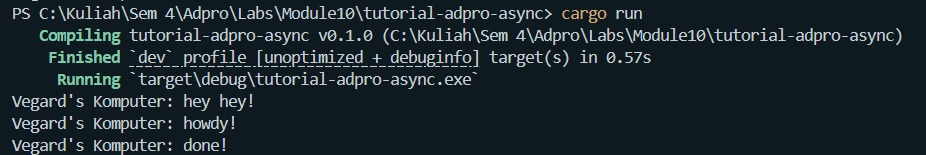

## Experiment 1.1: Original timer from the book

## Experiment 1.2: Understanding how it works

Output:

Explanation:
The "hey hey!" line prints before "howdy!" even though spawn() is called first.
This is because spawner.spawn() only queues the future — it does not execute it.
The async block only runs when executor.run() is called later.
This demonstrates that Rust futures are lazy: they make no progress until polled
by an executor.