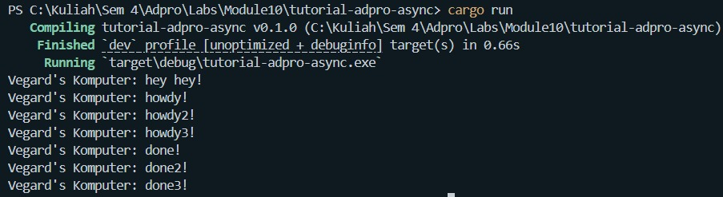
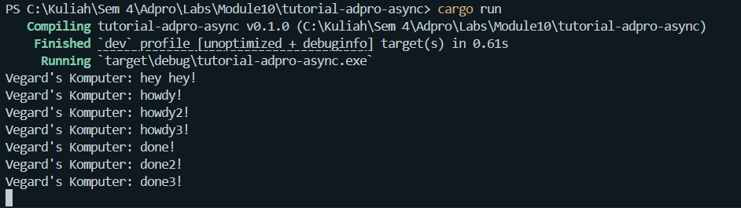

## Experiment 1.1: Original timer from the book

## Experiment 1.2: Understanding how it works

Output:

Explanation:
The "hey hey!" line prints before "howdy!" even though spawn() is called first.
This is because spawner.spawn() only queues the future — it does not execute it.
The async block only runs when executor.run() is called later.
This demonstrates that Rust futures are lazy: they make no progress until polled
by an executor.

## Experiment 1.3: Multiple Spawn and removing drop

With multiple spawns, all tasks run concurrently — the executor interleaves them.
All three "howdy" prints appear first, then after the timer, all three "done" prints appear.

Removing drop(spawner) causes the program to hang forever because the executor
keeps waiting for new tasks that will never arrive. drop(spawner) signals to the
executor that no more tasks will be submitted, so it can safely exit when the queue
is empty.